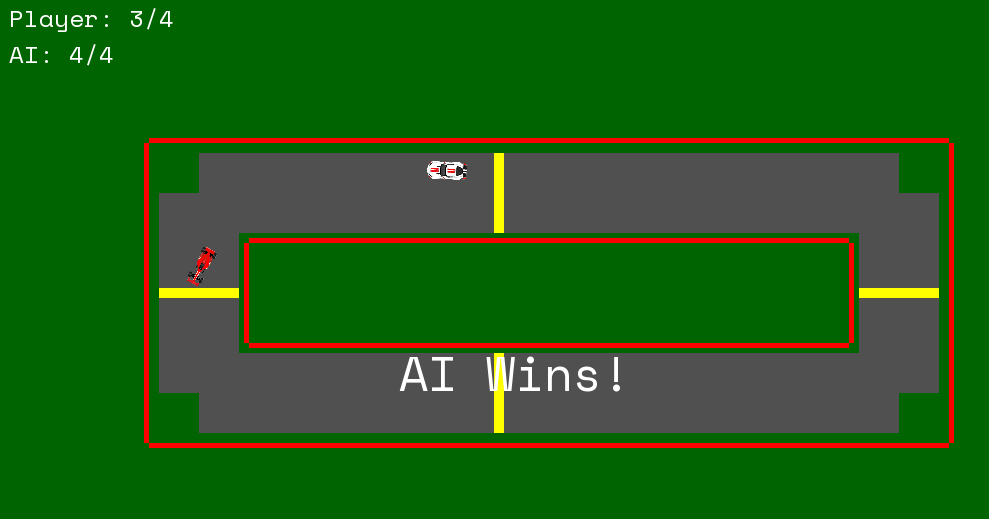

# Speed Racers
A 2D racing game where you compete against an AI that learns and optimizes its racing line.

## Description
Speed Racers is a SFML-based racing game where players race against an AI opponent on a track. The AI first undergoes a training phase to optimize its racing line, then challenges the player in a checkpoint-based race.

## Features
- Real-time 2D racing gameplay
- AI opponent that learns optimal racing paths
- Checkpoint-based racing system
- Track collision detection
- Visual progress tracking
- WASD controls for player movement

## Prerequisites
- C++ compiler with C++17 support
- SFML library
- Make (for building)

## Required Files
- `player1.png` - Texture for player car
- `player2.png` - Texture for AI car
- `blue_shader.frag` - Shader file for AI car coloring
- `arial.ttf` - Font file for UI text (optional)

## AI Training
As the `static const int GENERATIONS = 100;` constant increases, the AI undergoes more training iterations. This allows it to refine its racing strategy and optimize its path through the track. With each generation, the AI learns from its previous attempts, improving its decision-making and racing line, ultimately leading to better performance against the player.

## Building and Running

### Compile and Run

### Controls
- W: Accelerate
- S: Brake/Reverse
- A: Turn Left
- D: Turn Right

## Gameplay
1. When started, the AI will first undergo a brief training phase to optimize its racing line
2. After training, the actual race begins
3. Both player and AI must pass through all checkpoints in order
4. First to complete all checkpoints wins
5. Track borders will stop cars on collision

## Technical Details
- Uses SFML for graphics and input handling
- Implements genetic algorithm for AI path optimization
- Features collision detection with track borders
- Includes checkpoint validation system
- Real-time physics-based car movement

To Compile, Use make

and to run -- ./run